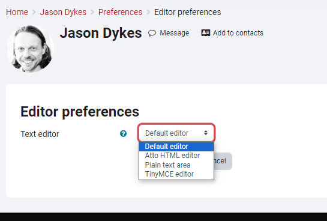
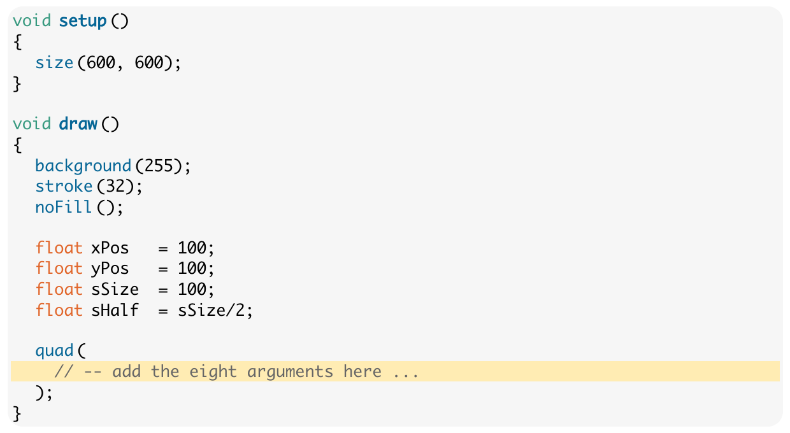

## BootCamp: Moodle 4 - Top Tips for Lecture Leaders

_If you are leading one of the BootCamp lectures and need to update materials on Moodle ... here are some **top tips** ..._

### Edit in HTML

The fancy Moodle editor messes our _BootCamp_ pages up, so edit in HTML:

You can set editor preferences in new Moodle here:

- https://moodle4.city.ac.uk/user/preferences.php?userid=352

Use **Default Editor**.

If you don't do this, then you will have to click buttons to get to the editor every time you need to edit a page as shown here ...

Click the down arrow (top left) then the HTML button <code>&nbsp;&lt;/&gt;&nbsp;</code>.

But in all honesty, you are much better off _Loading from an External URL_ and _Using an External editor and SVN_ ... 👇

External editors will make sure that your HTML is valid and this is important in the BootCamp pages as they use <code>&lt;div&gt;&nbsp;&lt;/div&gt;</code> tags to format and structure things.

### Load from External URL into Page with iframe

Moodle doesn't do a good job of keeping versions, so I strongly advise you to use some kind of _versioning and revision control_ system to develop and keep a record of materials.

You can then either :

- copy and paste your HTML into a Moodle page

or, much more efficiently, and my strong recommendation :

- load pages directly from your external SVN into an <code>&lt;iframe&gt;</code>

<pre>
&lt;iframe id="myIframe"
  src="https://jsndyks.github.io/cityBootCamp/html/interaction/2023%7C24/bootCamp.int.2023.lecture.html" width="100%"
  height="21750px"
  frameborder="0"
  scrolling="no"&gt;&lt;/iframe&gt;
</pre>

The [Interaction Lecture](https://moodle4.city.ac.uk/mod/page/view.php?id=420874) uses this approach by way of example - have a look.

It loads from this [GitHub Page](https://jsndyks.github.io/cityBootCamp/html/interaction/2023%7C24/bootCamp.int.2023.lecture.html), which I also mak reference to at the top of the document so that students can access it _outside of Moodle_.

You need to use [GitHub Pages](https://pages.github.com/) (_so easy that even I can do it_) and it is **smooth**, **simple**, **quick**, **reliable** and **generally lovely** ❤️.

The <code>height</code> thing is a problem at the moment - I am getting guidance on how to fix this!

But working in this way is my **strong recommendation**.

### Watch out for DIV!

Jo set things up in BootCamp to structure lecture content with <code>&lt;div&gt;&nbsp;&lt;/div&gt;</code> tags.

Content fits into a series of _rows_ that are structured line this ...

<pre>        &lt;div class="units-row"&gt;
            &lt;div class="unit-70"&gt;
                &lt;!-- Left column --&gt;
            &lt;/div&gt; &lt;!-- End of left column --&gt;

            &lt;div class="unit-30 annotation"&gt;
                &lt;!-- Right hand column for small images, popup sketches and annotations. --&gt;
            &lt;/div&gt; &lt;!-- end of right column --&gt;
        &lt;/div&gt; &lt;!-- End of row --&gt;
</pre>

So that's ...

| left column                                              | right column                                                                  |
| :------------------------------------------------------- | :---------------------------------------------------------------------------- |
| Main content, 70 characters wide (it wraps, don't worry) | Small images, popup sketches and annotations, 30 characters wide, top aligned |

For this to work, you need to make sure that your <code>&lt;div&gt;&nbsp;&lt;/div&gt;</code> tags close and that each _row_ contains a <code>unit-70</code> and a <code>unit-30</code> <code>&lt;div&gt;&nbsp;&lt;/div&gt;</code>.

Please, please, please check your HTML and make sure that your code is valid and your <code>&lt;div&gt;&nbsp;&lt;/div&gt;</code> tags line up and close!

### Format and Highlight Code in Pre tags

Make sure <code>code</code> goes in <code>&lt;pre&gt;&lt;/pre&gt;</code> tags with the following configuration (they should all look like this right now).

This will format it nicely and make it copyable.

<pre>
          &lt;pre class="brush: processing;
          gutter: false;
          toolbar: false;
          highlight: [18]"&gt;
          &lt;/pre&gt;
</pre>

The <code>highlight</code> number allows you to highlight a line of code - useful. Line 18 here.

### Hide and Reveal

In some of the newer lectures we run progressive programming challenges in class. This works pretty well.

This requires a '**Reveal**' button with solutions so that students can keep up with developing solutions.

See this lecture on [Vera Molnar](https://moodle4.city.ac.uk/mod/page/view.php?id=420935) for example - it contains lots of buttons that say ...

- _Click to Show Solution - But Have a Try First! Coding Takes Practice and Requires 'Doing'!_

Here's how to do it ...

<pre>
        &lt;!-- Hidden code button --&gt;
        &lt;span&gt;&lt;a href="#" class="link-show-code"&gt;Click to Show Solution - But Have a Try First! Coding Takes Practice and Requires 'Doing'! &lt;/a&gt;&lt;/span&gt;
        &lt;div class="prettyprint" style="display: none;"&gt;
          &lt;pre class="brush: processing; gutter: false; toolbar: false; highlight: [18]"&gt;
            quad(
              // -- add the eight arguments here ...
              xPos - sHalf, yPos - sHalf,
              xPos + sHalf, yPos - sHalf,
              xPos + sHalf, yPos + sHalf,
              xPos - sHalf, yPos + sHalf
            );
          &lt;/pre&gt;
          &lt;/div&gt;
</pre>

<b>Jason Dykes</b> 
20/09/2023

